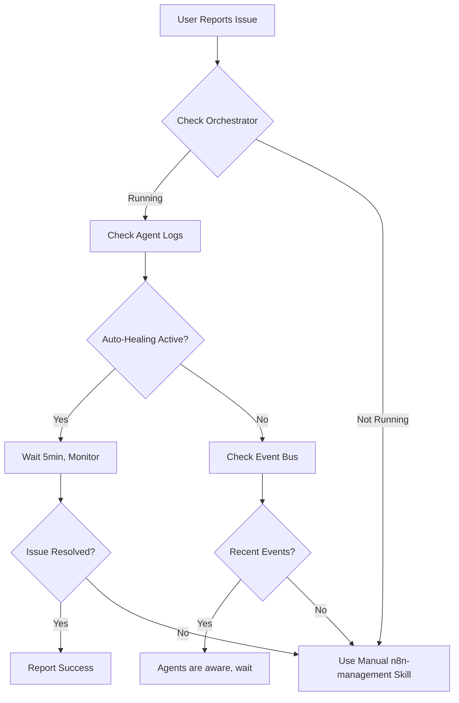

# Loopic Agent Integration Skill

This skill helps AI assistants coordinate with the autonomous agent loops running in the orchestrator.

## Overview

The n8n-infrastructure project uses **autonomous loopic agents** that run continuously in background loops:
- **Monitoring Loop** (30s): Health checks, anomaly detection
- **Optimization Loop** (5min): Performance tuning
- **Predictive Loop** (1min): Problem prediction
- **Learning Loop** (1h): Pattern learning
- **Maintenance Loop** (24h): Cleanup, backups

These agents are **always running** and handle most issues automatically. This skill helps you work **with** them, not against them.

---

## Autonomous Agents in the System

Located in `agents/orchestrator/src/agents/`:

1. **SupportAgent** (`support.agent.ts`)
   - Auto-healing when health checks fail
   - Error rate monitoring
   - Automatic recovery attempts

2. **DeploymentAgent** (`deployment.agent.ts`)
   - Automated workflow deployment
   - Multi-tenant management
   - Validation and rollback

3. **CustomizationAgent** (`customization.agent.ts`)
   - Workflow personalization
   - Template management

4. **MigrationAgent** (`migration.agent.ts`)
   - Data migration support
   - Workflow import/export

---

## When to Use This Skill

**Check agent status BEFORE manual intervention when**:
- User reports an issue that might already be handled
- Planning a system change that could conflict with auto-healing
- Investigating performance or reliability issues
- Wanting to understand what the system is doing automatically

---

## Capabilities

### 1. Check Orchestrator Status

**When to use**: Before any manual intervention, to see if agents are handling it.

**Instructions**:
```powershell
# Check if orchestrator is running
docker ps | Select-String "miconsul-orchestrator"

# If orchestrator is in this project (not all deployments have it running yet):
# View orchestrator logs
docker logs miconsul-orchestrator --tail 50

# Check for recent agent activity
docker logs miconsul-orchestrator --tail 100 | Select-String "SupportAgent|DeploymentAgent|CustomizationAgent"
```

**Expected Output**: 
- If orchestrator running: Logs showing agent activities and loop executions
- If not running: Empty result (agents are code artifacts, not yet deployed in all environments)

**What to do**:
- ✅ **If agents detected issue**: Wait for auto-healing, monitor progress
- ⚠️ **If no agent activity**: Proceed with manual fix, but log what you did
- 🔴 **If orchestrator not running**: This is development/early deployment phase, proceed with manual operations

---

### 2. Check Event Bus Activity

**When to use**: To see what events the system is processing.

**Instructions**:
```powershell
# If Redis is running (Event Bus):
docker ps | Select-String "redis"

# View Redis activity (if orchestrator is deployed):
docker logs miconsul-redis --tail 50
```

**Event Types to Look For**:
- `HEALTH_CHECK_FAILED` - SupportAgent will auto-heal
- `ANOMALY_DETECTED` - System is investigating
- `OPTIMIZATION_SUGGESTED` - System improving performance
- `ERROR_RATE_INCREASING` - Predictive alert

**What to do**:
- If events show agents are active → Let them work, monitor progress
- If no recent events → System is healthy or agents not deployed yet (check `agents/orchestrator/dist`)

---

### 3. Review Agent Loop Metrics

**When to use**: Understanding system health and autonomous performance.

**Instructions**:
```powershell
# If orchestrator dashboard is available (future feature):
# curl http://localhost:3000/dashboard

# For now, check agent code to understand what loops do:
Get-ChildItem "agents\orchestrator\src\agents" -Filter "*.agent.ts" | Select-Object Name

# Read specific agent logic:
Get-Content "agents\orchestrator\src\agents\support.agent.ts"
```

**Understanding the Loops** (from `docs/sistema_bucle_agentico.md`):

| Loop | Interval | Purpose |
|------|----------|---------|
| Monitoring | 30s | Detect failures, anomalies |
| Optimization | 5min | Improve performance |
| Predictive | 1min | Predict future issues |
| Learning | 1h | Learn patterns, best practices |
| Maintenance | 24h | Cleanup, optimize DB |

---

### 4. Coordinate with Auto-Healing

**When to use**: User reports issue, need to check if auto-healing is in progress.

**Instructions**:
```powershell
# Check recent n8n logs for recovery attempts
docker logs n8n-v2 --tail 100 | Select-String "restart|recovery|auto-heal"

# Check if SupportAgent triggered recovery (if orchestrator running):
docker logs miconsul-orchestrator --tail 50 | Select-String "SupportAgent.*recovery"

# Check Docker restart count (indicates auto-healing attempts):
docker inspect n8n-v2 --format='{{.RestartCount}}'
```

**Decision Tree**:
```
Is there an error?
  ├─ Yes → Check auto-healing logs
  │   ├─ Auto-healing in progress? 
  │   │   ├─ Yes → Wait 2-5 minutes, monitor
  │   │   └─ No → Proceed with manual fix
  │   └─ Auto-healing failed?
  │       └─ Escalate or manual intervention
  └─ No → All good, no action needed
```

---

### 5. Understanding Tenant Context

**When to use**: Multi-tenant operations, understanding which client is affected.

**Instructions**:
```powershell
# View tenant configuration (if exists):
Get-Content "agents\orchestrator\config\tenants.json" -ErrorAction SilentlyContinue | ConvertFrom-Json

# Or check environment for tenant info:
Get-Content ".env" | Select-String "TENANT"
```

**Tenant Features** (from agent code):
- `autoHealing`: Whether SupportAgent auto-restarts on failure
- `autoOptimize`: Whether OptimizationAgent applies fixes automatically
- `autoUpdate`: Whether system applies safe updates

**Note**: Current deployment may not have full multi-tenant setup yet. Check `IMPLEMENTATION_STATUS.md` for current phase.

---

### 6. Agent Deployment Status

**When to use**: Confirming which agents are actually running vs just code artifacts.

**Instructions**:
```powershell
# Check if orchestrator container exists:
docker ps -a | Select-String "orchestrator"

# Check docker-compose for orchestrator service:
Get-Content "docker-compose.yml" | Select-String "orchestrator" -Context 5

# Check implementation status:
Get-Content "IMPLEMENTATION_STATUS.md" | Select-String "agent|orchestrator" -Context 2
```

**Current State** (as of 2026-01-16):
- Agents exist as **code artifacts** in `agents/orchestrator/`
- May not be **deployed as running containers** yet (check docker-compose.yml)
- Documentation exists in `docs/sistema_bucle_agentico.md`
- Follows a phased implementation approach

---

### 7. Manual Override Guidelines

**When to use**: You need to do manual operation despite autonomous agents.

**Rules for Manual Intervention**:

1. **Always check first**: Run diagnostics to see if agents are handling it
2. **Wait for auto-healing**: Give agents 5 minutes to resolve before manual fix
3. **Log your actions**: Document what you did so agents can learn from it
4. **Coordinate with loops**: Don't restart during a monitoring cycle (30s window)
5. **Update Event Bus**: If you fix something, emit an event so agents know

**Example - Safe Manual Restart**:
```powershell
# 1. Check if auto-healing is active
docker logs n8n-v2 --tail 20 | Select-String "restart"

# 2. If no auto-healing in last 2 minutes, safe to proceed
# 3. Perform restart
docker-compose restart n8n

# 4. Monitor to ensure agents see the change
Start-Sleep -Seconds 30
.\monitor-n8n.ps1
```

---

### 8. Reading Agent Source Code

**When to use**: Understanding what agents can do automatically.

**Key Files**:
```
agents/orchestrator/src/
├── agents/
│   ├── support.agent.ts        # Auto-healing, error handling
│   ├── deployment.agent.ts     # Workflow deployment
│   ├── customization.agent.ts  # Personalization
│   └── migration.agent.ts      # Data migration
├── events/
│   ├── event-bus.service.ts    # Redis Pub/Sub
│   └── event-types.enum.ts     # All event types
└── loops/
    └── (future: monitoring.loop.ts, etc.)
```

**Reading Agent Code**:
```powershell
# View SupportAgent capabilities:
Get-Content "agents\orchestrator\src\agents\support.agent.ts"

# See what events it listens to:
Get-Content "agents\orchestrator\src\agents\support.agent.ts" | Select-String "eventBus.on"

# Check available event types:
Get-Content "agents\orchestrator\src\events\event-types.enum.ts"
```

---

## Workflow for AI Assistants

### Standard Troubleshooting Flow



### When to Choose Manual vs Autonomous

| Scenario | Autonomous | Manual |
|----------|-----------|--------|
| n8n container down | ✅ SupportAgent auto-heals | ⚠️ If fails after 5min |
| Workflow JSON invalid | ❌ Not auto-detected yet | ✅ Use n8n-management |
| High error rate | ✅ Monitoring Loop alerts | 🔄 Support investigates |
| New workflow deploy | ✅ DeploymentAgent | ✅ Or manual via UI |
| Credential expiring | ✅ Predictive Loop warns | ✅ Manual renewal needed |
| Performance slow | ✅ Optimization Loop fixes | ⚠️ If persists |

---

## Expected Behavior

### Healthy System
- Monitoring Loop running every 30s
- No critical events in last hour
- Auto-healing only triggered occasionally
- Optimization suggestions applied automatically

### System Under Stress
- Frequent HEALTH_CHECK_FAILED events
- SupportAgent actively recovering
- Error rate increasing alerts
- Manual intervention may be needed

### Development/Early Phase
- Orchestrator may not be deployed yet
- Agents are code-only (not running)
- Use manual skills from n8n-management
- Document issues for future agent training

---

## Best Practices

1. **Check Before Acting**: Always check agent status before manual intervention
2. **Respect Auto-Healing**: Give agents time to resolve issues (5min window)
3. **Coordinate Timing**: Don't interrupt during monitoring loops (30s cycles)
4. **Log Manual Actions**: Document what you did for agent learning
5. **Monitor Aftermath**: Verify agents see your changes and adjust

---

## Future Enhancements

As the orchestrator develops:
- Dashboard at `http://localhost:3000/dashboard` (planned)
- WebSocket for real-time event streaming
- Agent performance metrics
- ML-based prediction improvements

---

## References

- `docs/sistema_bucle_agentico.md` - Full autonomous system design
- `docs/agentes_mcp_resumen.md` - Agent summaries and use cases
- `agents/orchestrator/` - Agent source code
- `IMPLEMENTATION_STATUS.md` - Current deployment phase

---

**Last Updated**: 2026-01-16
**Version**: 1.0
**Agent Deployment Phase**: Check `IMPLEMENTATION_STATUS.md` for current status
